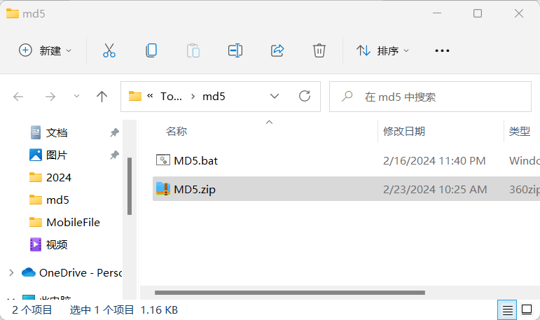
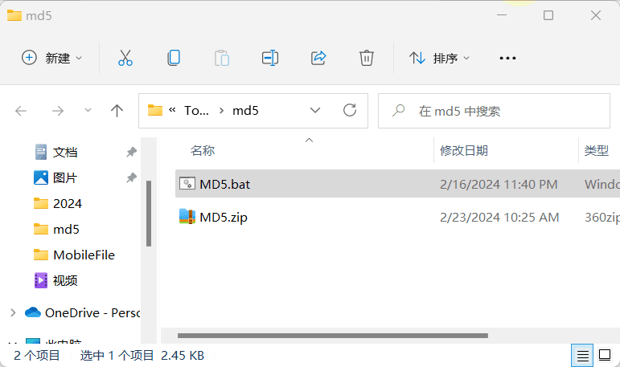

# md5.bat

  
## Describe
A file MD5 calculation tool written using the Windows command prompt. 一个用windows命令提示符写的文件MD5计算工具。  
### Drag and drop  
  
### Number  
  
### MD5 information  
名称：MD5.zip  
大小：1 KB  
MD5：becdc41ed373485d92f575a615c8d9e0  
SHA256：e38af4a446456837f4a9c4d7b83d7ce6a2671e0ce14ac48f149faed74f290bc7
